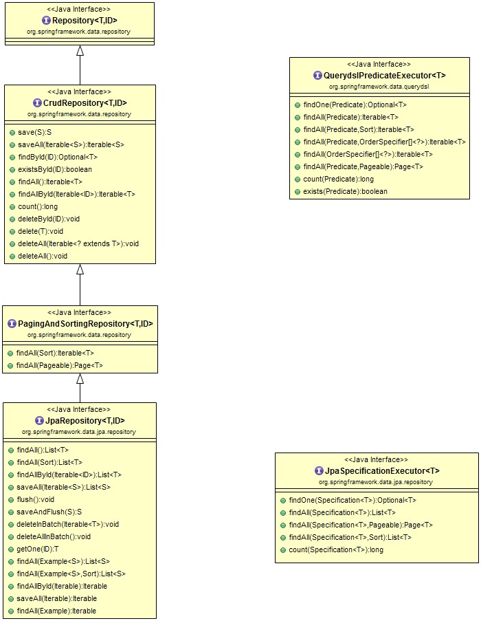

# Repository, Spring Data JPA, Native query, HQL
## 1. Repository
- Ở những phần trước đã nhắc tới `Controller`, `Service`, thì `Repository` chính là lớp còn lại của Spring Boot.
- `@Repository` là một trường hợp đặc biệt của `@Component`, bản thân annotation này đã được đánh dấu với `@Component`, thế nên một class được đánh dấu với `@Repository` sẽ được khởi tạo và đăng ký với ApplicationContext.

```java
    @Target({ElementType.TYPE})
    @Retention(RetentionPolicy.RUNTIME)
    @Documented
    @Component
    public @interface Repository {
        @AliasFor(
            annotation = Component.class
        )
        String value() default "";
    }
```
- Mục đích sử dụng của` @Repository` là để áp dụng trên các class dùng để thao tác với database.
- `@Repository` annotation có một vai trò đặc biệt dùng để chuyển đổi các database exception sang Spring-based unchecked exception (Các exception mà Spring có thể hiểu và xử lý được).

## 2. Spring JPA
### Mối quan hệ giữa JPA, Hibernate, Spring Data JPA
- `JPA` là một đặc tả định nghĩa các API cho các `ORM` và các `Persistent`.
- Hibernate là JPA implementation được sử dụng phổ biến trong các ứng dụng Java.
- Spring Data JPA sử dụng các chức năng của JPA để xây dựng một số tính năng như no-code repository, khởi tạo query thông qua tên hàm,...
### Sử dụng Spring Data JPA
Khi khởi tạo Repository, chúng ta sẽ implement 1 trong 3 interface sau:
- `CrudRepository`: định nghĩa các hàm cơ bản như `create`, `read`, `update` và `delete`.
- `PagingAndSortingRepository`: thừa kế từ `CrudRepository` và thêm `findAll` method cho phép chúng ta sắp xếp và truy xuất kết quả được phân trang.
- `JpaRepository` bổ sung thêm một số method dành riêng cho JPA như `flush`, `findAll`.
  

## 3. Native Query
Native Query là SQL, một ngôn ngữ truy vấn dữ liệu dựa trên các bảng, các cột.

## 4. HQL
### 4.1. Khái niệm
HQL là một ngôn ngữ truy vấn hướng đối tượng tương tự như ngôn ngữ SQL mà chúng ta hay sử dụng. Tuy nhiên thay vì sử dụng trên các bảng, các cột HQL lại làm việc với các đối tượng president và các thuộc tính của chúng và nó không phụ thuộc vào bất kỳ một database nào.
### 4.2. Đặc điểm
- HQL không phân biệt hoa thường (giống với ngôn ngữ SQL)
- From trong HQL cũng tương tự như SQL và chúng ta cũng có thể đặt alias cho nó. ví dụ như muốn lấy ra tất cả các sản phẩm của Product câu lệnh sẽ là: `Select Product p` tương đương với câu lệnh `select * from Product as p` trong SQL
- HQL hỗ trợ tất cả các loại Join có trong SQL như là Left Join, Right Join, Inner Join, Full Join,…
- HQL hỗ trợ các hàm thực hiện các phép toán như count, max, min, sum,…
- Chúng ta cũng có thể sử dụng các biểu thức so sánh trong HQL tương tự như là SQL
- Hỗ trợ câu lệnh order by để sắp xếp, Group By để phân nhóm

### 4.3. `@Query` annotation
 - `@Query` Annotation được dùng để khai báo các query cho các method trong Repository, khi mà các method của Spring Data JPA không thể đáp ứng.
 - Để sử dụng annotation `@Query`, ta sẽ khai báo nó trước các method của interface extends từ `JPARepository`, `CrudRepository` , và truyền câu HQL vào bên trong.
 - Để sử dụng Native QUery, ta sử dụng thuộc tính `nativeQuery = true` bên trong annotation `@Query`

```java
@Repository
public interface userRepository extends JpaRepository<User, Integer> {
    // find all user and sort by name
  @Query("SELECT e FROM User e ORDER BY e.name DESC")
  List<User> findAllOrderByNameDesc();

    //find all user with native query
  @Query(value = "SELECT * FROM user e ORDER BY e.name DESC", nativeQuery = true)
  List<User> findAllOrderByNameDescNative();

    //find user by username, and username is first param
  @Query("SELECT e FROM User e WHERE e.name = ?1")
  List<User> findByName(String name);

    // find user by username and address with @Param annotation
  @Query("SELECT e FROM User e WHERE e.name = :name AND e.address = :address")
  List<User> findByNameAndAddress(@Param("name") String name, @Param("address") String address);

}
```

## Tham khảo

[https://www.baeldung.com/spring-data-jpa-query](https://www.baeldung.com/spring-data-jpa-query)

[https://stackjava.com/spring/huong-dan-annotation-query-nativequery-trong-spring-data.html](https://stackjava.com/spring/huong-dan-annotation-query-nativequery-trong-spring-data.html)